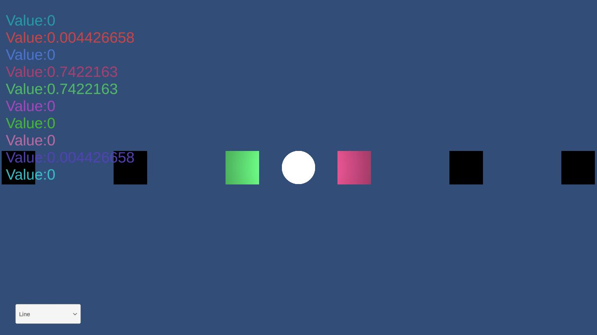

# SoundDistanceAttenuation

# [Demo](https://ayutaz.github.io/SoundDistanceAttenuation/WebGL/WebGL/)

[実装内容の記事](https://ayousanz.hatenadiary.jp/entry/%E8%B7%9D%E9%9B%A2%E6%B8%9B%E8%A1%B0%E3%81%A7%E3%81%AE%E5%90%84%E3%82%B5%E3%82%A6%E3%83%B3%E3%83%89%E9%9F%B3%E9%87%8F%E3%81%AE%E5%8F%96%E5%BE%97%E3%80%90Unity%E3%80%91)

# requirements

* Unity 2021.3.4f1

> **Note**
> 公開している音源は、自作したものなのでライセンスに基づきご自由にお使いください。

# 各シーン説明

# AudioVisualizer

* 円形に音量と距離を表示するビジュアライザー

## Line

* 平行にサウンドが配置されているシーン
* サウンドビジュアライザーはテキストベース

## Random

* ランダムな位置にサウンドが配置されているシーン
* サウンドビジュアライザーはテキストベース

## Simple

* シーン内にサウンドが左右に二つのみ配置されているシーン
* サウンドビジュアライザーはテキストベース

# class diagram

